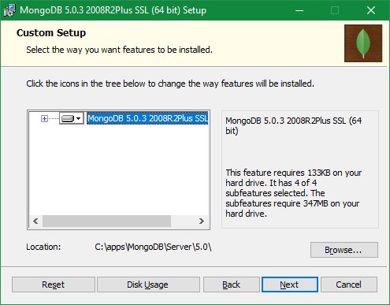
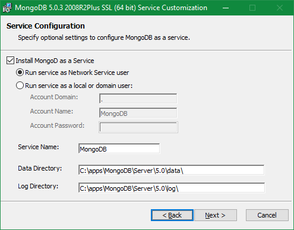

# MyMongoDB

My MongoDB

## Install on Windows 10





## VS Code extension

MongoDB for VS Code

## PyMongo

```
pip install pymongo
pip list --local
```

```
try:
import pymongo
print("Module Import Successful")
except ImportError as error:
print("Module Import Error")
print(error)
```
